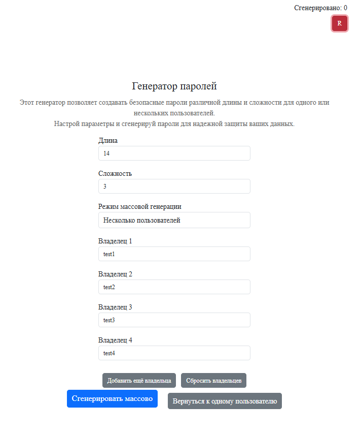

Веб-приложение для генерации и управления паролями с тегами. Использует PostgreSQL, BCrypt для шифрования, Spring Security для доступа, кэширование и CRUD-операции.

1. Сделать клиентскую часть (UI) с использованием любых технологий и/или библиотек (Spring MVC, JS-фреймворки: React, Angular и т.д.) для GET запроса (OneToMany/ManyToMany).
2. Реализовать UI для добавления, удаления и обновления.
   P.S. Для вдохновения используйте примеры сайтов, которыми пользуетесь сами: Google, Yandex, GitHub и т.д.

# Приветствие

Реализована кнопка для дальнейшего перехода 

# Клиентская часть 

На данной странице пользователь может выбрать как одиночную генерацию пароля (Один пользователь),так bulk-генерацию (Несколько пользователей).
Есть корректировка пароля путем выбора параметров : Длина пароля,Сложность пароля,Режим массовой генерации,Владелец.
 - `Параметр длины пароля` : Длина от 4 до 30. При выборе числа не из данного диапазона - покажет ошибку.
 - `Параметр сложности пароля` : Сложность пароля от 1 до 3. 
1. При выборе пользователем сложности "1", пароль будет состоять только из цифр.
2. При выборе пользователем сложности "2", пароль будет состоять из цифр и букв.
3. При выборе пользователем сложности "3", пароль будет состоять из цифр, букв и специальных символов.
 - `Параметр режима массоой генерации` : пользователь может выбрать одиночную генерацию,так и массовую генерацию(bulk)
 - `Параметр "Владелец"` : пользователь выбирает никнейм.
 - `Счетчик` : реализован в правом верхнем углу счетчик, который считает сгенерировванные пароли. Под счетчикм реализована кнопка "Reset",которая при нажатии производит сброс списка паролей и счетчика.

# Генерация при "Один пользователь"

# При generate-bulk

Реализованы кнопки для добавления владельцев,сброса владельцев,массовой генерации и возвращению к одиночному режиму.

# Работа счетчика / сброс счетчика

После успешных 5 генераций пароля счетчик показал число 5.

Был произведен сброс счетчика при котором очистилось значение счетчика и список сгенерированных паролей.

# Реализация ошибки 

